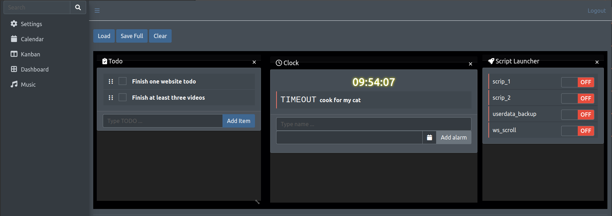

Jira is just better. No need for this project. Archived.
# Bodge Server
My personal webserver.


## Contents
- [Requirements](#requirements)
- [Features](#features)
- [Disclaimers](#disclaimers)

## Requirements
* Python >= 3.10

## Features
### Dynamic Blueprint Discovery
 * Every distinct part of the website is a blueprint with its own backend. They are discovered on startup. So, you can add your own blueprint without editing any code.
### Kanban with multiple views
 * Classic kanban:
    
Root, Branch, and Leaf can be thought of as if they are folders. A root can have infinite branches. A branch can have infinite leaves. Each leaf has Todo, In Progress, and Done (TPD) sections.<br>
Each task inside the TPD sections is draggable by mouse.<br>
Leafs can also have a deadline. In this case, unspecified task deadlines are set to the parent leaf deadline.<br>
Each task has a title, summary, deadline, priority, and story-point attributes.<br>

<p align="center">  </p>

 * Calendar view:
    
If the deadline is specified, tasks appear here. On top of that, you can specify recurring events by adding them to the generated `kanban.json` file. Add the following code to the list (`calendar_recurring`).
```json
{
    "allDay": false,
    "backgroundColor": "#0a73b0",
    "borderColor": "#0f7ff0",
    "daysOfWeek": [
        "6"
    ],
    "endRecur": "2024-08-31",
    "endTime": "17:00:00",
    "groupId": "recurring",
    "startRecur": "2022-08-14",
    "startTime": "10:00:00",
    "title": "supervisor"
},
```
 * Timeline view:
    
Completed tasks, which are moved to the Done column of classic kanban view, appear here.

 * Table view:
    
All the unfinished tasks appear here. You can also sort the columns.

 * Story Points view:
    
This is like Jira's story points but worse and buggy.

### Git remote repo for cloud backup

You must have git CLI and read/write permissions to your private repo.

### Dynamic Dashboard

Every card added as a seperate frame. They are dragable and resizable. You can save the final positions.

## Disclaimers
* I am not a web developer
* There are a lot of bugs
* Everything is designed for 1080p 15 inch monitor.
* Even though there is a login requirement, do not use the server outside your private internet.
